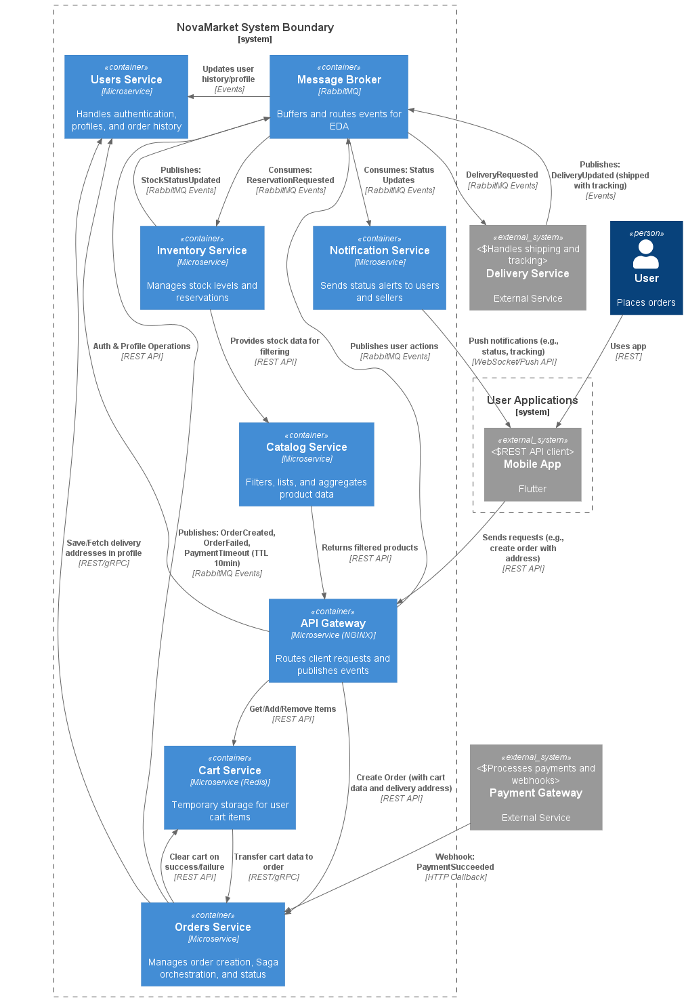
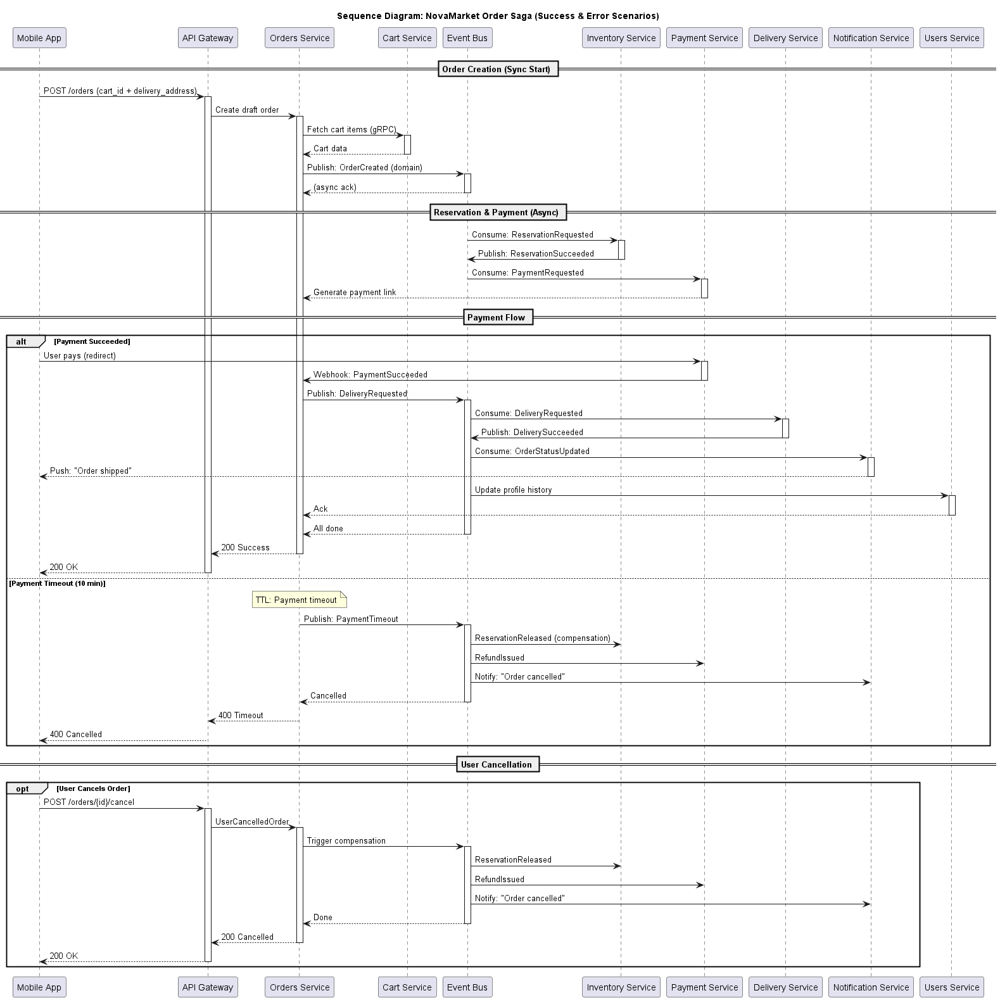

## Задание 1: Проектирование событийной архитектуры

### Контейнерная диаграмма (C2) в нотации C4

#### Ключевые компоненты
| Компонент                | Тип             | Технология          | Описание                                                                                                                 |
| ------------------------ | --------------- | ------------------- | ------------------------------------------------------------------------------------------------------------------------ |
| **Пользователь**         | Person          | -                   | Конечный пользователь (покупатель), взаимодействующий через мобильное приложение.                                        |
| **Мобильное приложение** | Внешняя система | Flutter             | Клиентское приложение для просмотра, корзины и оформления заказа (отправляет адрес доставки в payloads).                 |
| **API Gateway**          | Контейнер       | Микросервис (NGINX) | Точка входа для всех запросов; маршрутизирует в сервисы и публикует начальные события.                                   |
| **Сервис заказов**       | Контейнер       | Микросервис         | Оркестрирует Saga заказа: создаёт черновики, запускает резервирование/оплату, обрабатывает таймауты/компенсации.         |
| **Сервис пользователей** | Контейнер       | Микросервис         | Управляет аутентификацией, профилями (например, сохранённые адреса) и агрегирует историю заказов через события.          |
| **Брокер сообщений**     | Контейнер       | RabbitMQ            | Центральный хаб EDA: очереди событий (например, отложенные TTL для таймаутов оплаты) и фан-аут (несколько потребителей). |
| **Сервис инвентаря**     | Контейнер       | Микросервис         | Проверяет/резервирует запасы; публикует обновления для предотвращения перепродажи.                                       |
| **Сервис каталога**      | Контейнер       | Микросервис         | Агрегирует и фильтрует товары (цена, категория, рейтинг) с использованием данных о запасах из Inventory.                 |
| **Сервис корзины**       | Контейнер       | Микросервис (Redis) | Временное хранение товаров; передаёт данные в Orders при оформлении и очищает после Saga.                                |
| **Сервис уведомлений**   | Контейнер       | Микросервис         | Потребляет события для отправки push-уведомлений (например, изменения статусов, трекинг) пользователям/продавцам.        |
| **Платёжный шлюз**       | Внешняя система | Внешний сервис      | Сторонний (например, Stripe); интегрируется через webhook для подтверждения успеха.                                      |
| **Сервис доставки**      | Внешняя система | Внешний сервис      | Логистический провайдер (например, внешний API); получает запросы и публикует события трекинга.                          |

#### Таблица-реестр событий Saga-хореографии

| Этап                                      | Тип события     | Название             | Примечание (триггерит компенсацию?)                |
| ----------------------------------------- | --------------- | -------------------- | -------------------------------------------------- |
| Создание заказа                           | domain          | OrderCreated         | Старт Saga (с корзиной + адресом). Нет             |
| Запрос на резервирование товара           | domain          | ReservationRequested | Из Orders в Inventory. Нет                         |
| Резервирование успешно                    | domain          | ReservationSucceeded | Запасы заблокированы. Нет                          |
| Нет товара на складе                      | failure         | ReservationFailed    | Ранняя отмена. Да (OrderCancelled)                 |
| Подготовка ссылки для оплаты              | domain          | PaymentRequested     | Генерация ссылки. Нет                              |
| Оплата отклонена (например, карта)        | failure         | PaymentFailed        | От шлюза. Да (RefundIssued)                        |
| Успешная оплата                           | domain          | PaymentSucceeded     | Webhook. Нет                                       |
| Проверка таймаута оплаты (10 мин)         | timeout/control | PaymentTimeout       | Отложенное в RabbitMQ. Да (полная отмена)          |
| Отмена заказа пользователем               | domain          | UserCancelledOrder   | Пользователь жмёт "Отменить". Да (refund/release)  |
| Освобождение резерва (при отмене/ошибке)  | compensation    | ReservationReleased  | В Inventory. -                                     |
| Возврат средств (при ошибке/отмене)       | compensation    | RefundIssued         | Через Payment Gateway. -                           |
| Обновление/отмена заказа                  | compensation    | OrderCancelled       | Статус + уведомления. -                            |
| Уведомление о статусе (для всех этапов)   | control         | OrderStatusUpdated   | Фан-аут в Notification/Users. Нет                  |
| Запрос на доставку                        | domain          | DeliveryRequested    | После оплаты (с адресом). Нет                      |
| Доставка недоступна (ошибка логистики)    | failure         | DeliveryFailed       | Внешний сервис. Да (RefundIssued + OrderCancelled) |
| Подготовка посылки (уведомление продавца) | domain          | ShipmentPrepared     | Продавец готовит товар. Нет                        |
| Посылка отправлена                        | domain          | DeliverySucceeded    | Завершение Saga. Нет                               |
| Заказ завершён успешно                    | domain          | OrderFulfilled       | End-to-end успех; обновить историю. Нет            |

