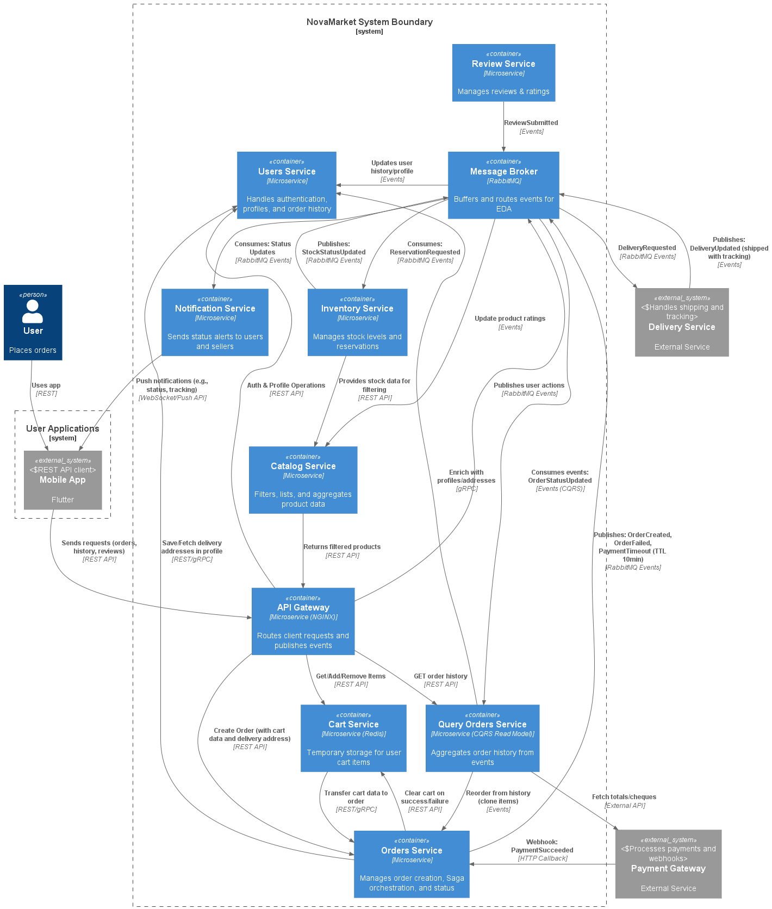

### Название задачи: 
Реализация просмотра истории покупок и отзывов с использованием CQRS

### Автор: Швецов Александр

### Дата:
29.10.2025

### Функциональные требования
| №   | Действующие лица или системы | Use Case                 | Описание                                                                                                                                                       |
| --- | ---------------------------- | ------------------------ | -------------------------------------------------------------------------------------------------------------------------------------------------------------- |
| 1   | Покупатель                   | Просмотр истории заказов | В личном кабинете отображается список всех заказов с датой, итоговой суммой, статусом и способом доставки. Поддержка фильтрации и сортировки.                  |
| 2   | Покупатель                   | Детали заказа            | При выборе заказа отображаются: список товаров (название, количество, цена), итоговая сумма, адрес доставки, способ оплаты, трек-номер, статус, ссылка на чек. |
| 3   | Покупатель                   | Скачать чек              | Возможность сгенерировать и скачать PDF-файл с данными заказа (товары, сумма, дата).                                                                           |
| 4   | Покупатель                   | Оставить отзыв           | После доставки можно оставить текстовый отзыв и оценку для каждого товара в заказе.                                                                            |
| 5   | Покупатель                   | Повторить заказ          | Кнопка «Заказать снова» добавляет те же товары в корзину (с проверкой наличия на складе).                                                                      |

### Нефункциональные требования
| №   | Требование                                                                       |
| --- | -------------------------------------------------------------------------------- |
| 1   | Отклик < 0.3с в 98% для GET history/reviews (read-model в Query).                |
| 2   | Масштабируемость: >40k запросов/день (HPA для Query/Review).                     |
| 3   | Eventual consistency: Обновления истории/рейтингов <5с после событий (RabbitMQ). |
| 4   | Безопасность: Только свои данные (JWT от Users).                                 |

### Решение
**Архитектурный подход**: Применён паттерн **CQRS (Command Query Responsibility Segregation)** в сочетании с **Event-Driven Architecture (EDA)**.

- **Write-side**:  
  Все изменения (создание заказа, оплата, доставка) обрабатываются в **Orders Service** через Saga-хореографию. События (`OrderCreated`, `PaymentSucceeded`, `DeliveryShipped` и др.) публикуются в **Message Broker (RabbitMQ)**.

- **Read-side**:  
  Создан отдельный микросервис — **Query Orders Service**, который:
  - Подписывается на события из шины.
  - Агрегирует данные в **materialized view** (оптимизированную read-модель).
  - Хранит данные в **Elasticsearch** для быстрого поиска, фильтрации и пагинации.
  - Добавляет данные через gRPC-вызовы к **Users Service** (адреса, профиль) и **Payment Gateway** (чеки).

- **Review Service**:  
  Отзывы обрабатываются отдельно: при создании публикуется событие `ReviewSubmitted`, которое:
  - Обновляет средний рейтинг в **Catalog Service**.
  - Сохраняется в read-модель **Query Orders Service** для отображения в истории.

- **Reorder**:  
  Запрос на повторный заказ отправляется в **Query Orders Service**, который формирует событие `ReorderRequested`, обрабатываемое **Cart Service** и **Orders Service** с проверкой наличия.

- **Технологии**:  
  - Elasticsearch — для read-модели (низкая задержка, full-text search).
  - Redis — кэширование часто запрашиваемых заказов.
  - gRPC — внутренние вызовы для обогащения данных.
  - Outbox Pattern — гарантия доставки событий (write в БД + publish атомарно).

**Диаграмма C2**: 

### Альтернативы
| Подход                                                            | Плюсы                                                                          | Минусы                                                                                                                                       |
| :---------------------------------------------------------------- | :----------------------------------------------------------------------------- | :------------------------------------------------------------------------------------------------------------------------------------------- |
| **API Composition** (агрегация на уровне API Gateway)             | Простота реализации на этапе MVP; минимальная инфраструктурная сложность.      | Высокая задержка при росте числа сервисов; тесная связность; не масштабируется до 40k+ заказов/день; нарушает требование по времени отклика. |
| **Event Sourcing** (полное хранение событий как источника правды) | Полная воспроизводимость состояния; аудит; гибкость в построении read-моделей. | Избыточная сложность для MVP; высокие требования к разработке и тестированию; не требуется для текущих бизнес-сценариев.                     |

**Обоснование выбора CQRS**:  
CQRS обеспечивает:
- Разделение ответственности между записью и чтением.
- Независимое масштабирование read- и write-сторон.
- Соответствие нефункциональным требованиям по производительности.
- Готовность к будущим расширениям.

### Недостатки, ограничения, риски
1. **Eventual consistency**:  
   Возможна временная несогласованность между фактическим статусом заказа и отображаемым в интерфейсе.  
   **Митигация**: ограничение задержки до 5 секунд, информирование пользователя («данные обновляются»), кэширование в Redis.

2. **Риск потери событий при dual-write**:  
   Запись в БД и публикация события могут рассинхронизироваться.  
   **Митигация**: использование **Outbox Pattern** с периодическим reconciler-процессом.

3. **Операционная сложность**:  
   Требуется поддержка Elasticsearch, RabbitMQ, мониторинг консистентности.  
   **Митигация**: автоматизация через Kubernetes, готовые Helm-чарты, логирование.

4. **Стоимость инфраструктуры**:  
   Elasticsearch и дополнительные сервисы увеличивают TCO.  
   **Обоснование**: окупается за счёт масштабируемости и соответствия SLA.