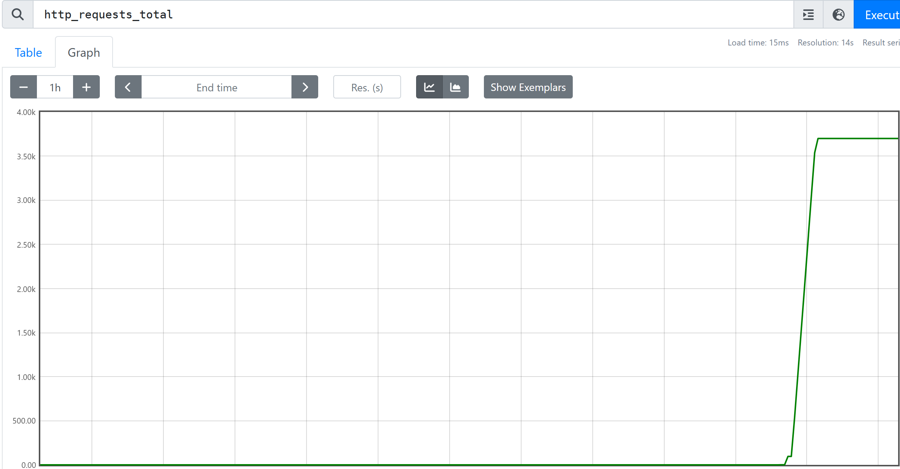
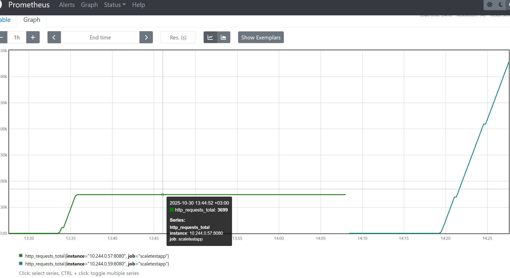
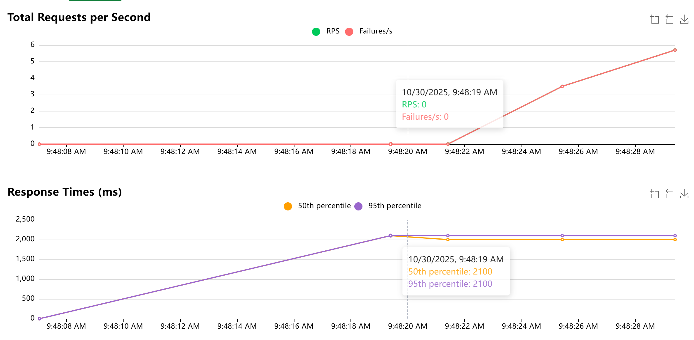
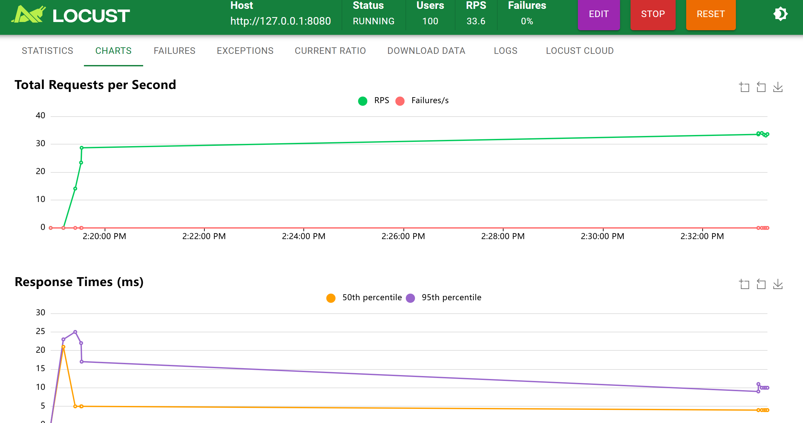
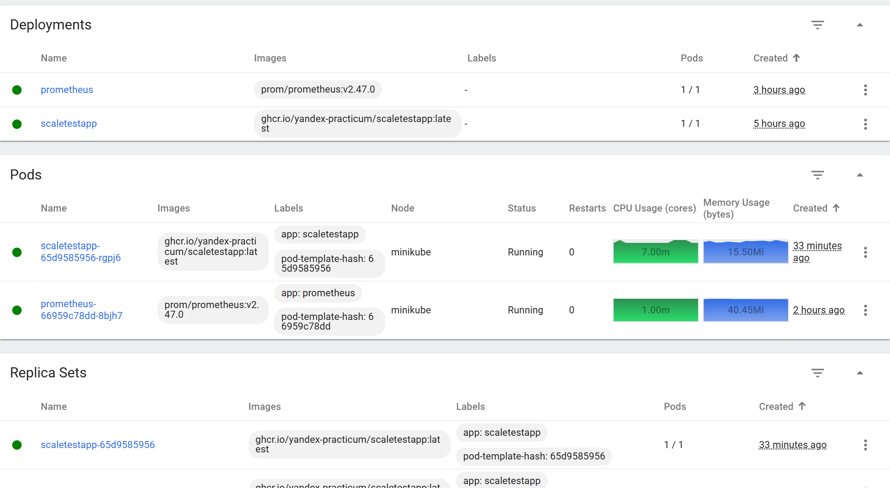

# Название задачи: Масштабирование приложения под нагрузку

### **Автор:**  
Швецов Александр

### **Дата:**  
30.10.2025

## **Решение**

### **Общее описание**

1. Развёрнуто приложение `scaletestapp` (образ `ghcr.io/yandex-practicum/scaletestapp:latest`) с аннотациями:
```yaml
   prometheus.io/scrape: "true"
   prometheus.io/port: "8080"
   prometheus.io/path: "/metrics"
```

Приложение публикует две метрики:

* `/` — возвращает идентификатор пода
* `/metrics` — отдаёт метрики Prometheus, включая `http_requests_total`

1. Создан `Service`:

   * Для доступа с хоста используется `kubectl port-forward svc/scaletestapp-service 8080:8080`.
   * Запросы к `http://127.0.0.1:8080` успешно доходят до пода.

2. Установлен `metrics-server` для метрик CPU и памяти.

3. Развёрнут Prometheus вручную (без оператора):

   * `ConfigMap` (`prometheus-config.yaml`) содержит конфигурацию `scrape_configs` с автоматическим поиском подов по аннотациям.
   * `RBAC` и `ServiceAccount` выданы Prometheus для доступа к подам.
   * В разделе **Targets** Prometheus отображается `scaletestapp` со статусом **UP**.

    
    

4. Настроен **HPA по памяти** [hpa.yaml](hpa.yaml):

   ```yaml
   averageUtilization: 80
   ```

   Реплики: min = 1, max = 10.

5. Настроен **HPA по количеству запросов (RPS)** [hpa-rps.yaml](hpa-rps.yaml):, использующий метрику `http_requests_total`.

6. Для проверки нагрузки используется **Locust**:

   ```bash
   kubectl port-forward svc/scaletestapp-service 8080:8080
   locust -f locustfile.py --host=http://127.0.0.1:8080
   ```

   * Количество пользователей: 100
   * Скорость появления: 5 пользователей/секунду
   * Результат: Prometheus фиксирует рост `http_requests_total`, HPA увеличивает количество реплик.

    
    


**kubernetes-dashboard**:
```bash
    minikube dashboard
```


